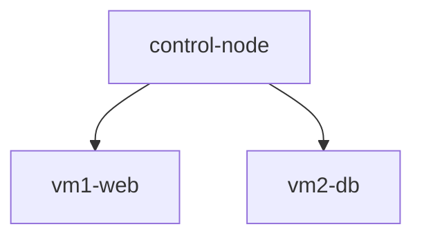

# Infraestructura en la nube con Terraform

[English](README.md) | Español

## Descripción
Creación de una infraestructura con tres maquinas virtuales en la nube mediante la herramienta Terraform.

> **Note:** Cabe destacar que esta solo es una parte paqueña del proyecto. En el conjunto general se usa otro programa en Ansible que crea los servidores correspondientes desde la máquina de control.

**Universidad de Oviedo**
Tercer año del grado en Ingeniería Informática del Software

**Asignatura**: Administración de Sistemas y Redes (ASR)

## Infraestructura

La estructura generada consta de 3 máquinas virtuales Ubuntu 22.04 LTS:
| Machine        | Purpose                                                                              |
| -------------- | ------------------------------------------------------------------------------------ |
| `control-node` | Máquina de control que serbirá como punto de entrada y permite manejar las otras dos |
| `vm1-web`      | Máquina que aloja el servidor web                                                    |
| `vm2-db`       | Máquina que aloja una BD                                                             |

### Arquitectura

## Estructura de archivos del proyecto

| File           | Description                                                                                                                       |
| -------------- | --------------------------------------------------------------------------------------------------------------------------------- |
| `network.tf`   | Crea el grupo de recursos `rg-asr-terraform` junto con la red virtual y la subred                                                 |
| `nsg.tf`       | Crea el grupo de seguridad y define las reglas del firewall (permite SSH y HTTP)                                                  |
| `outputs.tf`   | Variables que se imprimen cada vez que se ejecuta Terraform                                                                       |
| `provider.tf`  | Configuración general de terraform                                                                                                |
| `variables.tf` | Guarda las principales variables del sistema como localización de las maquinas, ips y los nombres de las maquinas                 |
| `vm.tf`        | Crea las maquinas virtuales así como todo lo relacionado inmediatamente a ellas como las ip, las interfaces de red para la subnet |