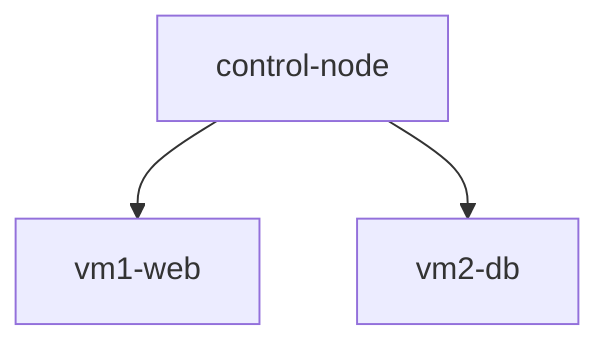

# Cloud Infrastructure with Terraform

English | [Español](README.es.md)

## Overview

This project provisions a cloud infrastructure composed of three virtual machines using Terraform.

> **Note:** This repository only contains the infrastructure provisioning component of the overall project. The complete solution also includes an Ansible project responsible for configuring the servers from a control machine after deployment.

**University of Oviedo**
Bachelor's Degree in Software Engineering
Third Year

**Course:** Systems and Network Administration (ASR by its Spanish acronym)

## Infrastructure

The generated infrastructure consists of three Ubuntu 22.04 LTS virtual machines:

| Machine        | Purpose                                                                        |
| -------------- | ------------------------------------------------------------------------------ |
| `control-node` | Control machine used as the entry point and for managing the remaining servers |
| `vm1-web`      | Hosts the web server                                                           |
| `vm2-db`       | Hosts the database server                                                      |

### Architecture

## Project Structure

| File           | Description                                                                           |
| -------------- | ------------------------------------------------------------------------------------- |
| `network.tf`   | Creates the resource group `rg-asr-terraform`, the virtual network, and the subnet    |
| `nsg.tf`       | Creates the Network Security Group (NSG) and configures firewall rules (SSH and HTTP) |
| `outputs.tf`   | Defines the output values displayed after Terraform execution                         |
| `provider.tf`  | Terraform provider configuration                                                      |
| `variables.tf` | Defines the main infrastructure variables such as region, IP addresses, and VM names  |
| `vm.tf`        | Creates the virtual machines, network interfaces, and associated networking resources |

